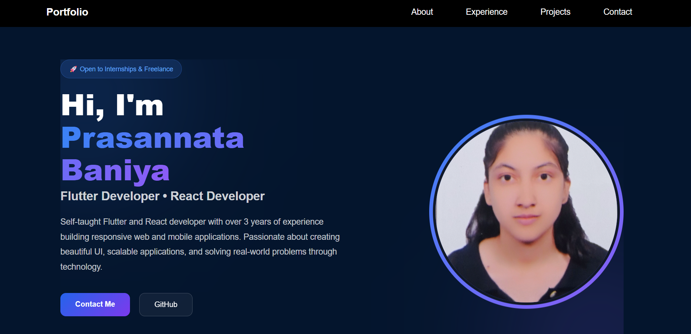
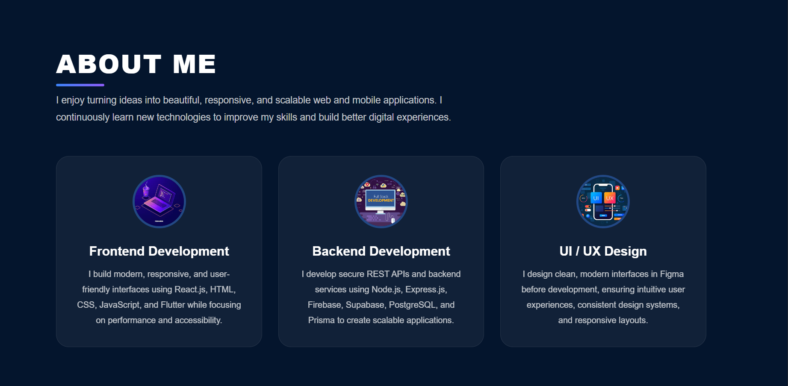
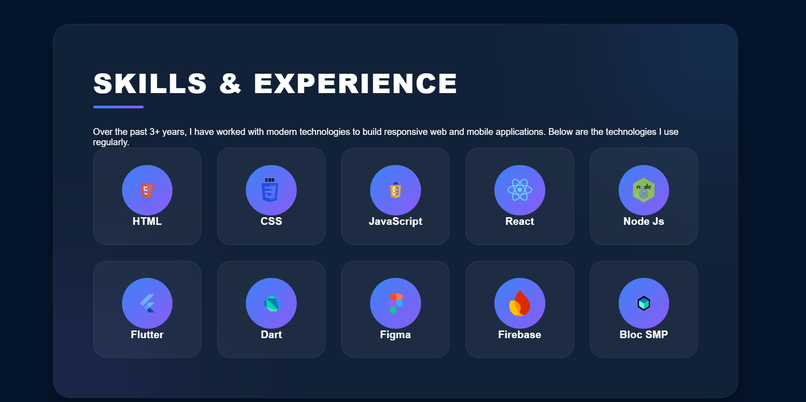
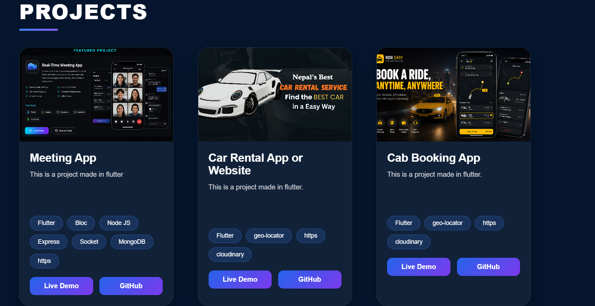
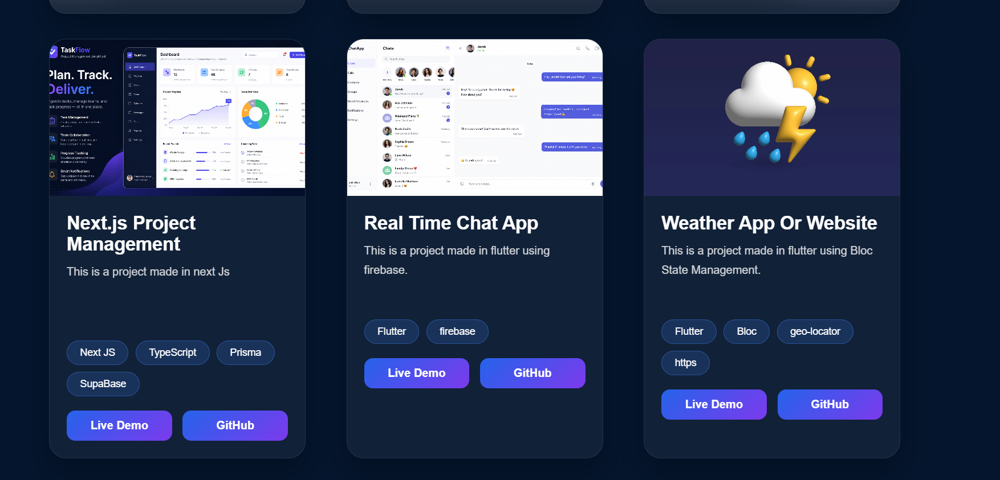
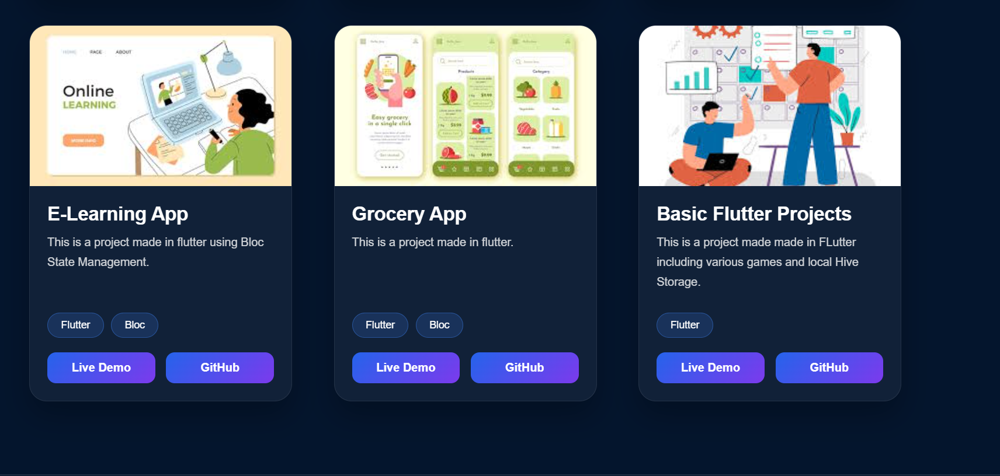
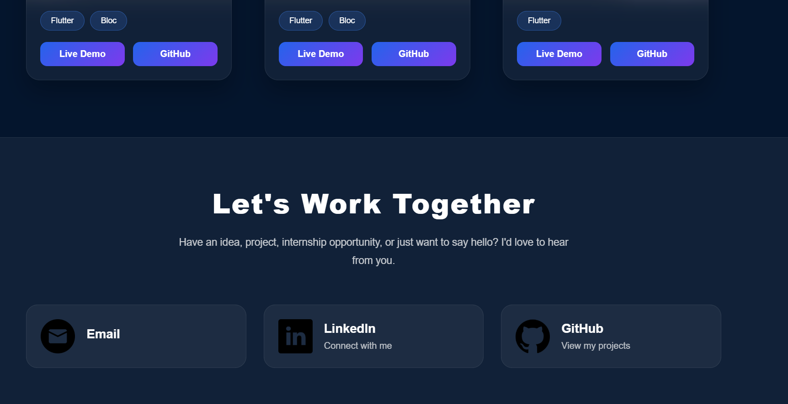

# 🌐 Prasannata Portfolio

A modern, responsive, and interactive personal portfolio built with **React** and **Vite**. This portfolio showcases my projects, technical skills, and contact information in a clean and professional interface.

---

## ✨ Features

* 🎨 Modern and responsive UI
* ⚡ Built with React + Vite
* 📱 Mobile-friendly design
* 💻 Project showcase section
* 🛠 Skills & experience section
* 👨‍💻 About Me section
* 📬 Contact section
* 🌙 Smooth animations and modern styling

---

## 📸 Screenshots

### 🏠 Home



### 👤 About



### 💼 Skills & Experience



### 🚀 Projects






### 📞 Contact



---

## 🛠 Tech Stack

### Frontend

* React.js
* Vite
* JavaScript (ES6+)
* HTML5
* CSS3 (CSS Modules)

### Tools

* Git
* GitHub
* VS Code

---

## 📂 Folder Structure

```text
src/
│
├── assets/
├── components/
│   ├── Hero/
│   ├── About/
│   ├── Experience/
│   ├── Projects/
│   ├── Contact/
│   └── Navbar/
│
├── data/
├── App.jsx
└── main.jsx
```

---

## 📌 Future Improvements

* Resume download
* Dark/Light mode
* Framer Motion animations
* Blog section
* Project filtering
* Improved accessibility
* Performance optimization

---

## 👤 Author

**Prasannata Baniya**

* GitHub: https://github.com/Prasannata1Baniya
* LinkedIn: https://www.linkedin.com/in/prasannata-baniya-060b792bb


